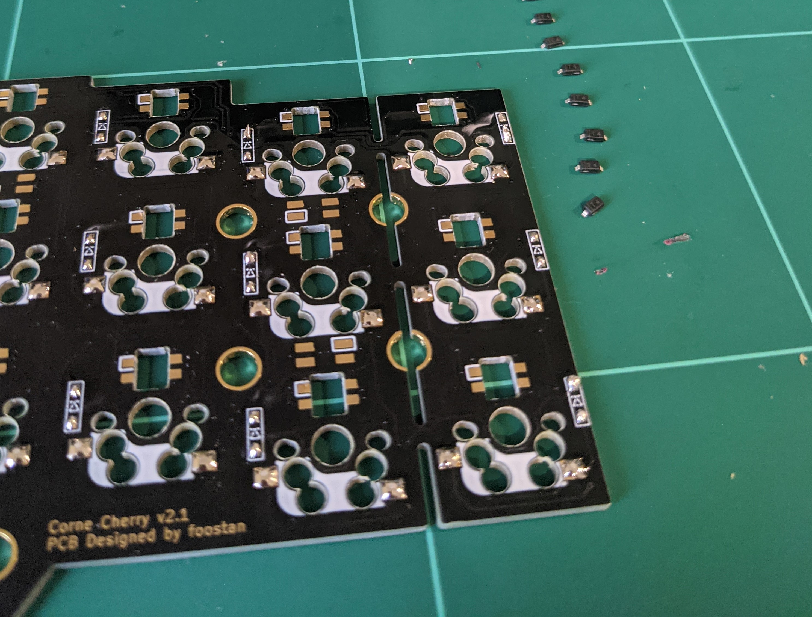
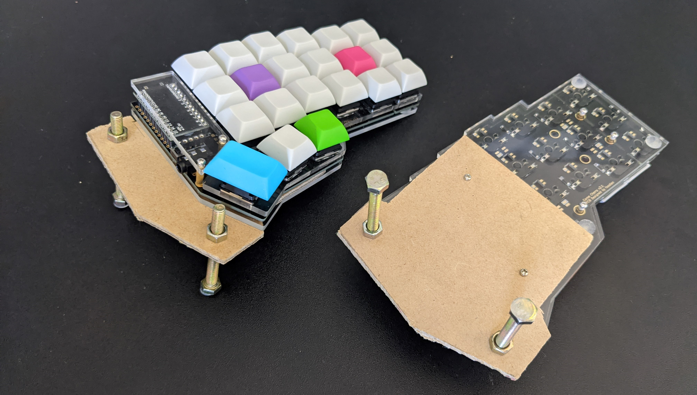
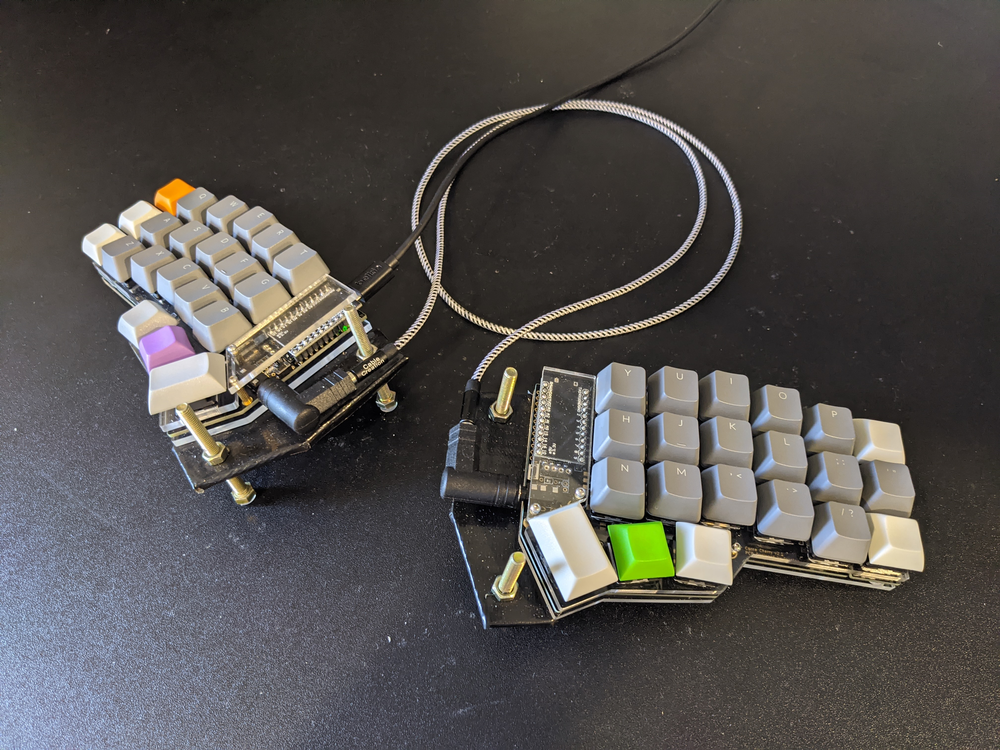
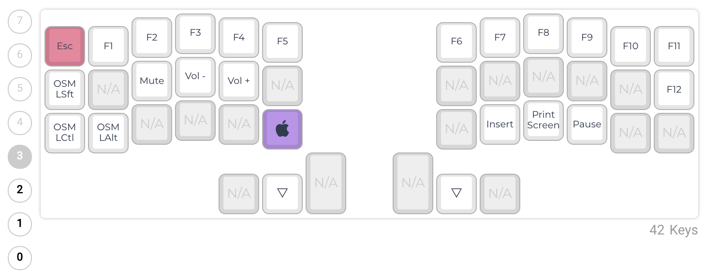

CRKBD build log and configuration

# Corne?

The [Corne keyboard](https://github.com/foostan/crkbd) is a split keyboard with 3x6 column staggered keys and 3 thumb keys.

The Corne Keyboard is an open source split ergonomic design that features a 3x6 column staggered layout with a three key thumb cluster. There are several things to unpack here:

* The software and hardware designs are open source. There is no manufacturer you have to assemble the parts from a kit or manufacture them yourself.
* The keyboard is split into two pieces, allowing for a natural wrist angle when typing.
* The 3x6 layout means fingers resting on the home row never have to move more than one key.
* The staggered columns provide a more resting position for the fingers on the home row and up / down movement when typing.
* The thumb clusters move work of the pinky fingers to the thumbs.

# Why Corne

I switched from using a regular keyboard to a [Microsoft Sculpt](https://www.microsoft.com/accessories/en-us/products/keyboards/sculpt-ergonomic-desktop/l5v-00001) several years ago to help reduce RSI.
The ergonomics were great, but I ended up replacing it every year due to wear and tear (mostly switches and stabilizers breaking or keys becoming sticky).
Instead of replacing it a 4th time I decided to give a regular layout another go and purchased a Keychron K2.
I would recommend the Keychron to anyone looking for a mechanical keyboard, but after several weeks I began to miss the ergonomics of the Microsoft Sculpt.
While looking for an ergonomic mechanical keyboard I came across the [Moonlander](https://www.zsa.io/moonlander/) and [Dygma](https://dygma.com/), but I couldn't justify their price tags.

Which is when I stumbled across the Corne. It incorporates the same design features, but could be built from a kit at a fraction of the cost. After watching a few videos I decided assembling the kit wasn't beyond my soldering ability.

I had been using https://www.keybr.com/ to improve my typing technique and had become fascinated with the home row, 40% layouts and QMK. I was looking for something where I didn't need to move fingers from the home row and several things about the standard keyboard layout were starting to annoy me.
* The distance from the home row to backspace and shift keys when typing.
* The ergonomics of doing shortcuts like copy / paste one handed.
* The way the stagger of the keys fights against the angle of the left wrist, but works with the right.

The Corne solved these issues by being split, using staggered columns instead of rows, making better use of the thumbs and allowing layering with QMK.

# Build Log

## Parts

* Clear Acrylic Case, Corne MX Hotswap PCB Kit, and 2 ProMicros from [littlekeyboards.com](https://www.littlekeyboards.com/collections/corne)
  * No RGB LEDs as I had read they were easy to burn out when soldering
  * I didn't order sockets from littlekeyboards, but ended up buying some from a local electronics store. I wanted the ability to remove the pro micro if the USB broke or I bricked it.
  * I ordered 2 OLED screens but ended up removing them. When used with the sockets sit too tall for the covers and don't really add anything to the design. They were also broken in the release of QMK at the time.
  * It was easier to find keycaps for the Cherry MX switches than the Kailh Low Profile Choc switches, hence the Corne MX Hotswap PCB Kit. I also wanted the option to swap the switches and this would have been a pain if they had been soldered to the board.
* Switches and Keycaps from kbdfans.com
  * Cherry MX brown switches, I had these on the Keychron K2 and they worked fine.
  * [DSA PBT Plain blank keycaps](https://kbdfans.com/collections/dsa-profile/products/dsa-pbt-60-blank-keycaps)
  * [DSA PBT Colored blank keycaps](https://kbdfans.com/collections/dsa-profile/products/dsa-pbt-dye-sub-multi-colored-keycaps?variant=34225333239947)
* A few screws, sockets, resistors (to use the legs for the sockets), and some epoxy from the local electronics store.

## Assembly

There is an official build guide on the CRKBD Github page. You can also find several video guides on like [this]((https://youtu.be/2xmAIC0CmGM)) one on YouTube. I won't go into great detail as other guides already do an excellent job of this.

The didoes were tiny and I needed to shine a light on them at an angle to figure out their direction.
The easiest way to solder these and the switch sockets was to apply a tiny bit of solder to each pad, then press the components into place with tweezers while heating them to melt the solder.
The diodes reheated quickly, with the sockets I found I needed to press the soldering iron into the corner of the pad to ensure there was a larger area for better heat transfer.

I applied EPoxy to the pro micro USB connectors as they are notorious for breaking. I also used sockets and resistor legs to mount the pro micros so they could be removed if this happened. With sockets the pro micros sit higher than normal and the OLED screens don't fit under the covers.

Make sure the resistor legs click into the socket before soldering them to the pro micro.
On the first half two legs were too short to make a connection with the socket, causing a row of keys to not register.
I managed to figure this out by shorting different parts of the board but it took a while and was a pain to remove the pro micro and de solder the pins.

On the second half I accidentally shorted one of the pro micro connectors with a socket on the reverse side of the PCB, causing one key to not register. You can see this in the image below, the 5th pin down on the right hand column has some solder that connects with the col3 socket. It was easy enough to unsolder.

The switches, keycaps and case were straight forward to assemble. I did bend the pins on a few switches by being too forceful, fortunately these are easy to bend back and slot into the sockets smoothly once aligned correctly.

Fully assembled, except the screen covers.

After using the board for a few days I decided to tent it slightly. With the board flat I either needed to rotate my wrists of keep my elbows at an awkward angle. Tenting the boards your elbows to rest at your side and without putting any rotational strain through your writs. I had difficulty finding a tented plate / case online and ended up cutting some wooden plates that I could screw into the existing case with some longer m2 screws. I covered these in black tape for a cleaner finish and used bolts to adjust the height. There are .ai and .dxf files for a tented case in the Github repo but I don't have a laser cutter.

You will notice I switched back to printed keycaps. Blanks were fine for typing. But horrible when you wanted to perform a specific short cut without anchoring on the home row.

# Keymap

I used the default keymap for a day before starting to modify it to better fit my workflows in Windows, VS Code, word processing (email, Jira, Teams). My current layout has 4 layers that are activated by holding the center thumb cluster keys. The left thumb activates the symbol layer, the right thumb activates the navigation layer, and both activate the mouse and function layer.

## Base layer

* Standard Qwerty layout.
* OSM modifiers on the left Ctrl and Shift. When holding these down they act as normal Ctrl or Shift, when tapped they apply to the next key you press and then deactivate, when tapped three times they stay activated until tapped again. This allows you to tap Ctrl then c rather than holding both keys down at once with one hand. Or lock Ctrl like you would Shift with the caps lock key.
* Alt + Tab can be activated with a single hand.
* Shift and Enter share a key, when held the key acts as shift, when tapped it acts as enter. This is useful for typing as you can keep your fingers on the home rows and use your thumbs for space, shift and enter. The tap / hold configuration does cause a slight delay to register the difference between a tap and hold. While noticeable on some keys this is fine with enter.
* Right thumb ctrl key for more ergonomic two handed shortcuts.
* Escape and delete are missing. Tab switches to escape on all other layers and delete is present on the symbol layer.
* A dedicated `_` key in the bottom right corner for typing in `camel_case_without_any_modifier_keys`.

## Navigation and Numpad layer

The navigation and numpad layer is activated by holding down the right thumb.

* The navigation key cluster is also on the right allowing you to browse a document one handed.
* Originally the numbers ran across the Querty row. These have been moved into a number pad on the left, which allows the arrow keys to sit on the home row.
* Windows key appears on the left hand side for shortcuts windows + direction shortcuts.

## Symbol layer

The symbol layer is activated by holding down the left thumb.

* Shift + number symbols are in their relative positions along the qwerty row.
* Modifier keys are in the same place on all layers for shortcuts like Ctrl + Shift + `+`.
* Atl key moved from the thumb cluster as the left thumb is already used to activate this layer.
* No symbol requires shift to access, which makes them no more awkward than on a normal keyboard. Shift + 9 for ( becomes symbol + `o`.

## Function layer

* Function keys where the corresponding numbers would be, with the exception of F12, which moves down one.
* Contains infrequently used and some media keys.

## Lessons

* Keep the modifier keys in the same places across layers. I had most of these switching places to fit around other keys and perform specific shortcuts. At one stage I tried using the four home row keys on non default layers for modifiers, but my muscle memory kept using the Ctrl and Shift keys from the default layer.
* It isn't natural to constantly use a computer with both hands glued to the home row. Figure out what one handed functionality you need to keep. Mine were ctrl + c/v/a/s/f, alt + tab, and up / down / left / right.
* Don't overuse osm or tab and hold combo keys. There is a delay when using these to differentiate between a tap and a hold. This is fine on some keys like shift + enter. But when I tried using shift when holding the f and j key the delay was too annoying.
* Touch typing with blanks is fine, but doing anything else is a pain. Especially when you are hunting for a specific key for a shortcut or symbol one handed.
* Don't do too much with one hand. At one stage I had modifier key on the right navigation layer. The idea was to toggle Shift / Ctrl and then use the arrows, but I kept accidentally toggling. You normally use a second hand for modifiers when navigating on a standard keyboard anyway.
* Mouse keys were a fun gamic, but I couldn't find a good use for them. I had these on the function layer for a while.

# Useful Commands

`qmk compile -kb crkbd/rev1/common -km bettsmatt`