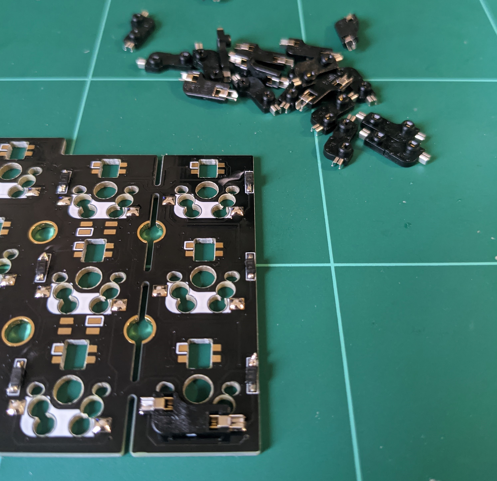
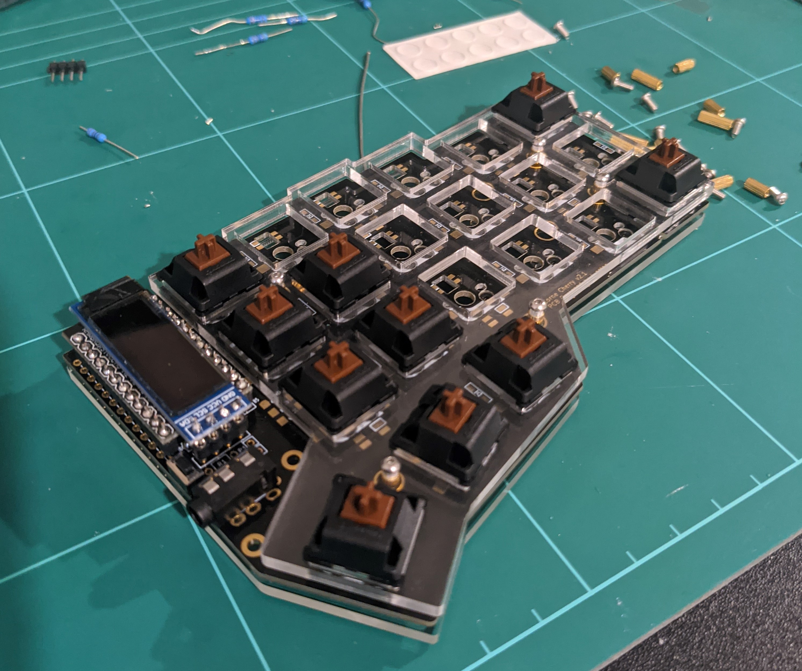
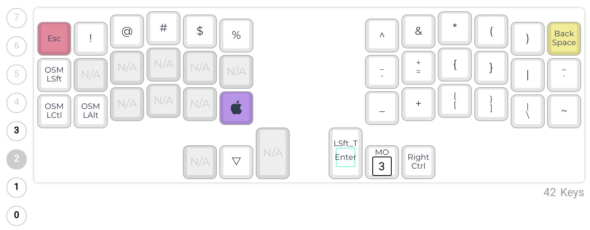

CRKBD build log and configuration

# Why Corne

Four years I switched from using a regular keyboard to a Microsoft Sculpt to reduce RSI.
The ergonomics of the keyboard was great, but I ended up replacing it every year due to wear and tear.
Mostly switches and stabilizers breaking or keys becoming sticky.
Instead of replacing it a 5th time I decided to give the standard layout another go and purchased a Keychron K2.
I would recommend the Keychron to anyone looking for a mechanical keyboard, but after several week of use I began to miss the ergonomics of the sculpt.
So I started looking for a more ergonomic mechanical keyboard and came across products like the Moonlander and Dygma raise.
These looked really interesting, but I couldn't bring myself to buy a keyboard quite that expensive.

Which is when I stumbled across the Corne. It incorporated the same features in its design, but could be built from a kit at a fraction of the cost.
I had done a few small hobbyist electronics projects before and after watching a few videos decided building the keyboard wouldn't be too difficult.

I had also been actively focusing on improving my typing technique and was looking for something with layers where I didn't need to remove my fingers from the home row.
Additionally a few things about the standard keyboard layout started to annoy me.
* The distance from the home row to backspace and shift keys when typing.
* The ergonomics of doing shortcuts like copy / paste one handed.
* How the keys on the right hand are staggered to move with the angle of the arm, but the keys for the left hand are staggered in the opposite direction.

The Corne has two 6 by 3 grids with three thumb keys.
Which means all your fingers move at most one key from the home row while typing.
This includes the shift and backspace keys.
It is split, so it can be angled like the Microsoft Sculpt.
Instead of the rows being staggered the columns are staggered, allowing your fingers to rest in a more natural position and move directly up and down when typing.
The layout is completely customizable using QMK, allowing it to be tailored to specific programs and shortcuts. Beyond layering, QMK provides some really innovative features.

# Build Log

## Parts

I ordered the kit + case + two pro micros from littlekeyboards.com for a total of $61 USD.
I opted for the hot swappable socket version as as I didn't want to solder the switches directly to the board.
I didn't buy the RGB LEDs as it is very easy to overheat them when soldering and my soldering wasn't great.
I purchased two OLED screens, but ended up disabling and removing these.
I would recommend getting the low profile sockets, so you don't have to solder the board to the controller, I ended up picking these up from a local electronics store.

The switches and keycaps are from kbdfans.
50 Cherry MX Brown switches cost $22.50 and I bought two packs of DSA PBT keycaps. A plain set for $19 for most of the keys and a dyed set $23.80 for a bit of additional color.
I also ended up picking up a few screws, sockets, some resistors, and some epoxy from the local electronics store.

The real killer was shipping cost to Australia during a Pandemic.

## Assembly

There is an official build guide on the CRKBD github page. You can also find several video guides on youtube, [this one](https://youtu.be/2xmAIC0CmGM) was my favorite. I'm not going to into great detail below as other build guides already do an excellent job.

The didoes were smaller than I thought and I needed to shine a light on them at an angle to figure out their direction.
The easiest way to solder these and the switch sockets was to apply a tiny bit of solder to each pad, then press the components into place with tweezers while heating them to melt the solder.
The diodes reheated quickly, with the sockets I found I needed to press the soldering iron into the corner of the pad to give a larger area for better heat transfer.

I applied EPoxy to the pro micro USB connectors, as they are notorious for breaking.
I also used sockets and transistor legs to mount the pro micros so they could be removed if this happened. This does mean the pro micros sit higher than normal, which was why I ended up removing the OLED screens to fit the covers on.

If you are going to use transistor legs in the sockets, make sure they click into the socket before soldering them.
On the first board two legs were too short to make a connection with the socket, causing a row of keys to not register.
I managed to figure this out by shorting different parts of the board but it tool a while and was a pain to resolder.

On the second board I accidentally shorted one of the pro micro connectors with the reverse set of sockets, causing one key to not register.
You can see this in the image below (5th pin down on the right hand column) and it was easy enough to unsolder.

The switches, keycaps and case were straight forward to assemble. I did bend the pins on a few switches by being too forceful, fortunately these are easy to bend back and slot into the sockets smoothly once aligned correctly.

The finished board

After using the board for a few days I decided to tent / raise it so my writs are at a more natural angle.  I had difficulty finding a plate / case online and ended up cutting some wooden plates that I could screw into the existing case with some longer m2 screws. I covered these in black tape for a nicer finish and used bolts to adjust the height.

# Keymap

I used the default keymap for a day before starting to modify it to better fit my workflows in Windows, VS Code and typing.

## Current

### Default

* Qwerty layout, at some point I intend to try colmack or workman, but didn't want to change too much at once. With QMK it should also be easy enough to toggle between these on the keyboard instead of in the OS.
* OSM modifiers on the left CRTL and Shift keys. These mean if you hold down the key it acts as a normal Ctrl or Shift, but if you tap it the next key press will be modified. This allows you to tap ctrl then c for copy rather than trying to hold both keys down at once with one hand. These are awesome and should be part of a standard keyboard.
* Alt and Tab is on the sam half, allowing a single hand alt + tab action.
* The left middle thumb key activates the symbol layer when held. The right middle thumb key activates the navigation layer when held. When both are held the mouse and function layer is activated.
* Shift and Enter share a key, when held the key acts as shift, when tapped it acts as enter. This is super useful for typing as you can keep your fingers on the home rows and use your thumbs for space, shift and enter. The tap / hold does cause a slight delay to register the difference, this is very noticeable on some keys, but manageable when used on enter with shift.
* Right thumb ctrl key for two handed shortcuts.
* No escape key, this replaces tab with either layer is activated. This isn't anywhere as annoying as it sounds as the layers are activated and deactivated by your thumbs instantly.

### Navigation and Number

The navigation and number layer is activated by holding down the right thumb.
* The navigation key cluster is also on the right so any of the navigation keys can be accessed with one hand.
* Special OSM ctrl + shift key so you can select and navigate by word using a single modifier key.
* Numbers in their normal positions along the qwerty row. At some point want to experiment with a numpad style number layout on the left side of this layer.

### Symbol

The symbol layer is activted by holding down the left thumb.
* Symbols in there normal positions along the qwerty row. Very similar to how you press shift to access these normally. Except you don't have to stretch as far as they are one row lower and you are using your thumb and not your pinky to hold shift.
* Same modifier keys as navigation and number row for shortcuts like (ctrl, shift, + / - ) to resize text.
* Additional alt key as you left thumb is already holding down the modifier key and won't be able to press an additional key.

### Mouse and function

* Function keys where the corresponding numbers would be, with the exception of F12, which moves down one.
* OSM left alt key specifically for shortcuts like atl + F4.
* Keys for moving the mouse where the navigation keys are, speed modification and clicking on the left side. I haven't really found a use for these, but they are handy if you quickly want to focus a window or move the cursor across the page without taking your hand off the keyboard.

### Lessons
* Try not to move modifier keys around between the the layers. Originally I had most of these switching to fit around other keys and perform specific shortcuts. For example at one stage I used the four home row keys on non default layers for modifiers, but my muscle memory kept trying to use the ctrl and shift keys from the default layer I was using seconds earlier.
* One handed short cuts. It isn't natural to have both hands hovering over the home row at all times. Make common shortcuts like ctrl+c, alt+tab and down easy to preform with one hand.
* Don't overuse tab / hold keys, there is a necessary delay when using these to differentiate between a tap and a hold. This is fine on some keys like shift + enter. But I tried using shift on hold on the f + j keys, and the delay would make it look like these keys had not been pressed for a few hundred ms and when typing quickly I would accidentally caps other keys by pressing them before releasing shift.

# Useful Commands

`qmk compile -kb crkbd/rev1/common -km bettsmatt`